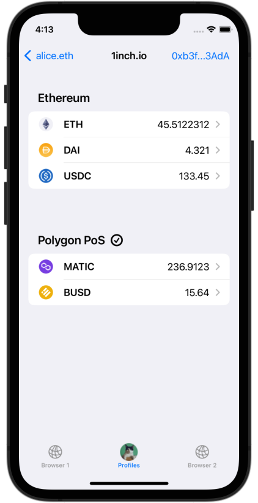

# Automated Burner Wallets

## One-Dapp-per-Key&reg;

When you add a dapp to your account, a new key is generated just for this dapp.
Wallet addresses are never connected to dapps.  This isolation

- prevents **phishing** &#127907;
- mitigates damage from compromised dapps &#129399;
- enables **automatic transaction approval** &#129395;

<figure markdown>
{ loading=lazy }
</figure>

You can read more about how automated burner wallets work under the hood in the
[technical documentation.](./dev-docs/design/one-dapp-per-key.md)

## Dapp Address

A dapp address is just like a wallet address. You can send and receive tokens with it.

<figure markdown>
{ loading=lazy }
</figure>

## Transfer Funds

SealVault makes it easy to transfer funds between your wallet and dapp
addresses. You can configure sending a small amount of native tokens
automatically to each newly added dapp address for transaction fees.

<figure markdown>
{ loading=lazy }
</figure>

## Beta

iOS beta is coming October 2022. Sign up for an invite [here.](https://76u1o4gk7en.typeform.com/to/DxKsEMKM)
